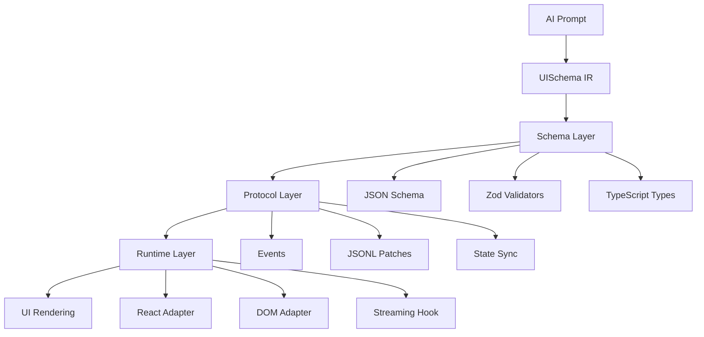

# UISchema: Standards-Aligned, Token-Efficient Generative UI IR

UISchema is a formal, framework-agnostic UI schema standard with protocol layer for AI-generated interfaces. Ships with React (Next.js/RSC) adapter, compressed shorthand for token efficiency, explicit bridges to Open-JSON-UI/AG-UI/MCP Apps, and coarse-to-fine generation patterns.

**Why a UI IR?** Getting reliable structured *data* out of an LLM is a solved, standard practice now — but for *interfaces*, models usually emit throwaway, framework-locked React/HTML that's inconsistent and often inaccessible. UISchema is the validated layer in between: the model targets one schema, every document is validated + accessibility-checked + auto-repaired, and the same schema renders to React, Vue, or the DOM. One contract, any framework, accessible by construction.

## Clone and Use

Get started in minutes:

```bash
# Clone the repository
git clone https://github.com/skeehn/ui-schema.git
cd ui-schema

# Install dependencies
npm install

# Build all packages
npm run build

# Run tests to verify everything works
npm test
```

That's it! You're ready to use UISchema in your projects.

## Features

- ✅ **Standards-Aligned**: Profiles/extensions of Open-JSON-UI, AG-UI, MCP Apps (not competing)
- ✅ **Token-Efficient**: 3-5x token reduction via compressed CFG shorthand
- ✅ **DX-First API**: `<UISchemaRenderer />` + `generateUISchema(prompt)` - <5min hello world
- ✅ **Any AI Backend**: `@uischema/ai` works with any OpenAI-compatible API or any LLM SDK (Anthropic, Vercel AI SDK, …)
- ✅ **Small Primitives**: Minimal set (Layout/Input/Display/Action) with extension hooks
- ✅ **Basic Accessibility**: Schema-level constraints + optional axe-core integration
- ✅ **React Adapter**: Full RSC support, streaming via `useUIStream` hook
- ✅ **Protocol Layer**: Minimal events (ui.update/ui.interaction) + JSONL patches

## Quick Start (<5 minutes)

### Use it

> The `@uischema/*` packages aren't published to npm yet — clone the monorepo
> ([Clone and Use](#clone-and-use)) and import them via the npm workspace (or
> `npm link` the ones you need). Once published this becomes
> `npm install @uischema/core @uischema/react`.

### Basic Usage

```tsx
import { UISchemaRenderer } from '@uischema/react';
import schema from './uischema.json';

export default function Page() {
  return <UISchemaRenderer schema={schema} />;
}
```

### Create Your First Schema

Create `uischema.json`:

```json
{
  "schemaVersion": "0.1.0",
  "root": {
    "type": "Container",
    "props": {
      "ariaLabel": "Hello world container"
    },
    "children": [
      {
        "type": "Text",
        "props": {
          "text": "Hello, UISchema!",
          "ariaLabel": "Greeting text"
        }
      },
      {
        "type": "Button",
        "props": {
          "text": "Click me",
          "ariaLabel": "Example button"
        }
      }
    ]
  }
}
```

See [Getting Started Guide](./docs/getting-started.md) for detailed instructions.

## Generate UI with Any AI Backend

`@uischema/ai` turns a natural-language prompt into a validated, render-ready UISchema document. It has no provider SDK dependencies and works two ways:

**1. Any OpenAI-compatible endpoint** — OpenAI, Groq, Together, OpenRouter, Ollama, vLLM, or your own gateway:

```ts
import { generateUISchema } from "@uischema/ai";

const { document, a11yIssues } = await generateUISchema(
  "A newsletter signup card with an email input and a subscribe button",
  {
    baseURL: "https://api.groq.com/openai/v1", // or api.openai.com/v1, localhost:11434/v1, …
    apiKey: process.env.GROQ_API_KEY,
    model: "llama-3.1-8b-instant"
  }
);
```

**2. Bring your own model call** — plug in the Anthropic SDK, Vercel AI SDK, LangChain, or anything else:

```ts
import Anthropic from "@anthropic-ai/sdk";
import { generateUISchema } from "@uischema/ai";

const anthropic = new Anthropic();

const { document } = await generateUISchema("A settings form with a dark-mode switch", {
  generateText: async ({ system, prompt }) => {
    const message = await anthropic.messages.create({
      model: "claude-opus-4-8",
      max_tokens: 4096,
      system,
      messages: [{ role: "user", content: prompt }]
    });
    const block = message.content.find((b) => b.type === "text");
    return block ? block.text : "";
  }
});
```

Every result is schema-validated (Zod) and accessibility-checked before you render it. Malformed model output is auto-repaired: fences and prose are stripped, trailing commas tolerated, and validation errors are sent back to the model for a retry (`repair` option). For providers with structured outputs, `uischemaJsonSchema` exports the JSON Schema to pass as a response format or tool definition.

Then render the result with any adapter:

```tsx
import { UISchemaRenderer } from "@uischema/react"; // or @uischema/vue
<UISchemaRenderer schema={document} />
```

## Packages

- `@uischema/core` - Schema definition, validators, TypeScript types
- `@uischema/ai` - Provider-agnostic AI generation (any OpenAI-compatible API or any SDK)
- `@uischema/compressed` - CFG shorthand, expansion, coarse-to-fine pipeline
- `@uischema/bridges` - Open-JSON-UI, AG-UI, MCP Apps bridges
- `@uischema/protocol` - Minimal protocol (patches, events, state)
- `@uischema/react` - React adapter with DX-first API
- `@uischema/vue` - Vue 3 adapter
- `@uischema/dom` - Framework-agnostic DOM adapter (browsers + jsdom)
- `@uischema/eval` - WCAG accessibility engine (schema preflight + DOM audit)
- `@uischema/cli` - Validation CLI, preview server, type generation

## Architecture

UISchema follows a layered architecture:


```mermaid
graph TB
    A[AI Prompt] --> B[UISchema IR]
    B --> C[Schema Layer]
    C --> D[Protocol Layer]
    D --> E[Runtime Layer]
    E --> F[UI Rendering]
    
    C --> C1[JSON Schema]
    C --> C2[Zod Validators]
    C --> C3[TypeScript Types]
    
    D --> D1[Events]
    D --> D2[JSONL Patches]
    D --> D3[State Sync]
    
    E --> E1[React Adapter]
    E --> E2[DOM Adapter]
    E --> E3[Streaming Hook]
```

**Schema Layer**: Defines UI components using JSON Schema with Zod validation  
**Protocol Layer**: Handles agent↔UI communication via events and patches  
**Runtime Layer**: Framework adapters (React, DOM) with streaming support

See [Architecture Guide](./docs/architecture.md) for detailed information.

## Documentation

### Getting Started
- [Getting Started Guide](./docs/getting-started.md) - Step-by-step setup and first project
- [Testing Guide](./docs/testing.md) - Running the unit, smoke, and AI integration tests

### Core Concepts
- [API Reference](./docs/api-reference.md) - Complete API documentation with examples
- [Architecture](./docs/architecture.md) - System design and data flow
- [Component Catalog](./docs/component-catalog.md) - Define component guardrails (coming soon)
- [Streaming UI](./docs/streaming-ui.md) - Progressive rendering with JSONL patches (coming soon)
- [Code Export](./docs/export-as-code.md) - Export generated UI as standalone code (coming soon)

### Interoperability
- [Open-JSON-UI Mapping](./docs/open-json-ui-mapping.md) - Interoperability with Open-JSON-UI
- [AG-UI Mapping](./docs/ag-ui-mapping.md) - Protocol compatibility with AG-UI
- [MCP Apps Mapping](./docs/mcp-apps-mapping.md) - MCP integration guide

## Examples

### Basic Examples
- [Hello World](./examples/hello-world/) - Simple UISchema JSON file with basic components
  - Shows Container, Text, and Button components
  - Demonstrates basic props and children structure

### Production Examples
- [Next.js + Vercel AI SDK](./examples/nextjs-vercel-ai-sdk/) - Full Next.js integration
  - Server-side AI generation with Vercel AI SDK
  - Client-side rendering with UISchema
  - Streaming UI updates
  - See [README](./examples/nextjs-vercel-ai-sdk/README.md) for setup instructions

## Development

```bash
# Install dependencies
npm install

# Build all packages
npm run build

# Run unit + smoke tests (see docs/testing.md for the full matrix)
npm test

# Validate schema (use node directly inside the monorepo)
node packages/uischema-cli/dist/cli.js validate examples/hello-world/uischema.json

# Start preview server
node packages/uischema-cli/dist/cli.js preview
```

## Roadmap

### v1.0 (Current)
- ✅ Core schema (small primitives)
- ✅ Compressed representation (3-5x token reduction)
- ✅ Spec bridges (Open-JSON-UI, AG-UI, MCP Apps)
- ✅ Minimal protocol (patches, events, state)
- ✅ React adapter + DX-first API
- ✅ Basic CLI (validate, preview, types)
- ✅ Documentation
- ✅ Next.js example

### v1.1+ (Future)
- Full WCAG 2.1 engine
- Web DOM adapter
- Full evaluation suite
- Full protocol layer
- Additional framework adapters

## Contributing

Contributions welcome! See [Contributing Guide](./CONTRIBUTING.md) for:
- Development setup
- Code style guidelines
- Pull request process
- Testing requirements

## License

MIT
