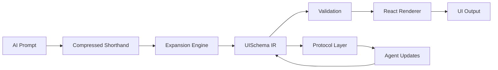
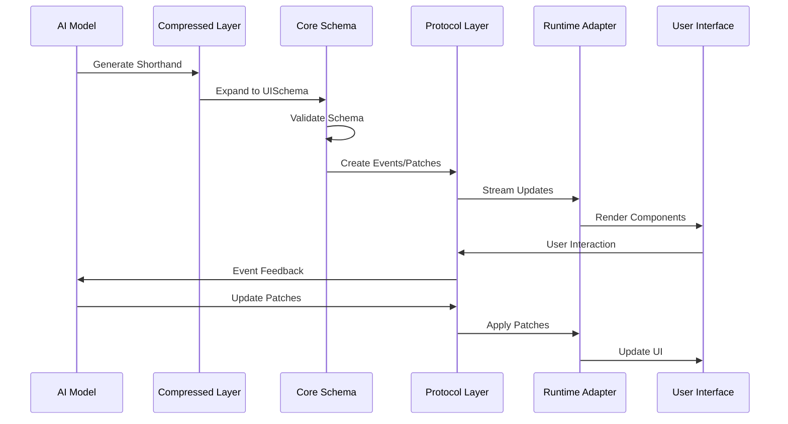
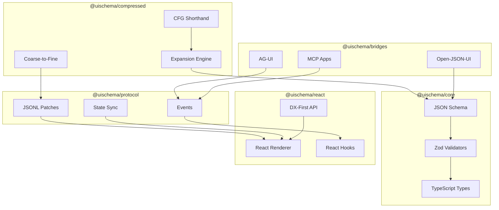
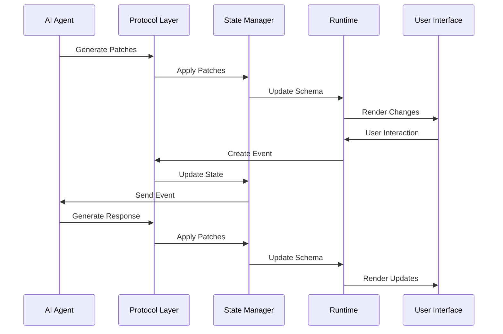

# UISchema Architecture

UISchema is architected in **five layers** with explicit standards alignment and token efficiency.

## Layer 1: Compressed Representation (Token Efficiency)

**Package**: `@uischema/compressed`

Provides CFG-based shorthand for 3-5x token reduction vs raw JSON.

- **Shorthand Parser**: Parses compact DSL syntax
- **Expansion Engine**: Expands shorthand to full UISchema
- **Coarse-to-Fine Pipeline**: Layout skeleton → refinement patches

## Layer 2: UISchema Core (Small Primitives)

**Package**: `@uischema/core`

Defines the core schema with small, composable primitive set.

- **JSON Schema**: Formal specification (small primitives + extensions)
- **Zod Validators**: Runtime validation
- **Basic Accessibility**: Schema-level constraints

## Layer 3: Spec Bridges (Standards Alignment)

**Package**: `@uischema/bridges`

Provides explicit bridges to existing specs (not competing, extending).

- **Open-JSON-UI Bridge**: Bidirectional conversion
- **AG-UI Bridge**: Protocol compatibility
- **MCP Apps Bridge**: Message format support

## Layer 4: Minimal Protocol Layer

**Package**: `@uischema/protocol`

Minimal event protocol for agent ↔ UI communication.

- **Patch Operations**: JSONL streaming (set/add/replace/remove)
- **Minimal Events**: ui.update / ui.interaction only
- **Basic State Sync**: Widget-scoped and private state

## Layer 5: React Adapter (DX-First)

**Package**: `@uischema/react`

React renderer with DX-first API surface.

- **React Renderer**: Renders UISchema to React components
- **Streaming Hook**: `useUIStream` for progressive updates
- **DX-First API**: `<UISchemaRenderer />` + `generateUISchema(prompt)`

## Data Flow

### Detailed Flow

## Component Relationships

## Protocol Flow

## Design Principles

1. **Standards-Aligned, Not Competing**: UISchema is a profile/extension of existing specs
2. **Token Efficiency First**: Compressed shorthand achieves 3-5x reduction
3. **Small Primitives + Extensions**: Minimal set with extension hooks
4. **DX-First API**: Hide complexity, expose simple surface
5. **Vertical Slice v1**: React adapter + Next.js example only

## Extension Points

- **Custom Components**: Register via `registerComponent()`
- **Custom Types**: Use `x-` or `custom:` prefixes
- **Custom Validators**: Extend Zod schemas
- **Custom Bridges**: Implement bridge interfaces

## Future Layers (v1.1+)

- Full WCAG 2.1 engine
- Web DOM adapter
- Full evaluation suite
- Full protocol layer
- Additional framework adapters
