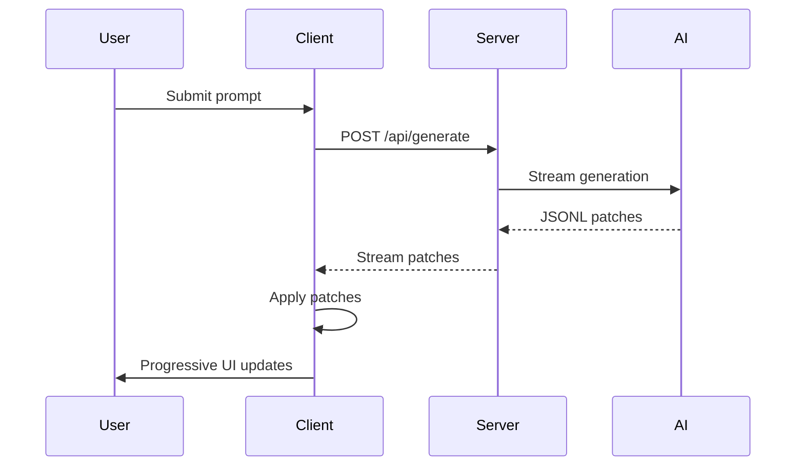

# Streaming UI Guide

Streaming UI allows progressive rendering of UISchema as it's generated, providing real-time feedback to users. This guide covers setting up streaming endpoints, understanding JSONL patch format, and implementing progressive rendering.

## What is Streaming UI?

Streaming UI enables:

- **Progressive Rendering**: UI appears as it's generated, not all at once
- **Real-time Updates**: Changes stream in via JSONL patches
- **Better UX**: Users see progress immediately
- **Lower Latency**: First content appears faster

## How Streaming Works



1. **Client** sends prompt to server
2. **Server** streams generation from AI
3. **AI** emits JSONL patches (one per line)
4. **Client** applies patches progressively
5. **UI** updates in real-time

## Setting Up Streaming

### API Endpoint Setup

Create a streaming endpoint using Vercel AI SDK:

```typescript
// app/api/generate/route.ts
import { streamObject } from 'ai';
import { openai } from '@ai-sdk/openai';
import { z } from 'zod';

export async function POST(req: Request) {
  const { prompt } = await req.json();

  const result = streamObject({
    model: openai('gpt-4o-mini'),
    prompt,
    schema: z.object({
      root: z.object({
        type: z.string(),
        props: z.record(z.unknown()).optional(),
        children: z.array(z.lazy(() => z.any())).optional(),
      }),
    }),
  });

  return result.toDataStreamResponse();
}
```

### Custom Streaming Implementation

For more control, implement custom streaming:

```typescript
import { Readable } from 'stream';

export async function POST(req: Request) {
  const { prompt } = await req.json();

  const stream = new ReadableStream({
    async start(controller) {
      // Generate UI schema
      const patches = await generatePatches(prompt);
      
      // Stream patches as JSONL
      for (const patch of patches) {
        const line = JSON.stringify(patch) + '\n';
        controller.enqueue(new TextEncoder().encode(line));
      }
      
      controller.close();
    },
  });

  return new Response(stream, {
    headers: {
      'Content-Type': 'text/plain; charset=utf-8',
      'Transfer-Encoding': 'chunked',
    },
  });
}
```

## JSONL Patch Format

JSONL (JSON Lines) is a format where each line is a valid JSON object. For UISchema streaming, each line is a patch operation.

### Patch Operations

UISchema supports four patch operations:

1. **set**: Set a value at a path
2. **add**: Add to an array at a path
3. **replace**: Replace a value at a path
4. **remove**: Remove a value at a path

### Patch Structure

```typescript
type PatchOperation = {
  op: 'set' | 'add' | 'replace' | 'remove';
  path: string;  // JSON Pointer path
  value?: unknown;  // Required for set/add/replace
};
```

### JSON Pointer Paths

Paths use JSON Pointer format (`/root/children/0/props/text`):

- `/` - Root
- `/root` - Root node
- `/root/children/0` - First child
- `/root/children/0/props/text` - Text prop of first child
- `/root/children/-` - Append to children array

### Examples

#### Set Operation

```json
{"op": "set", "path": "/root/props/ariaLabel", "value": "Main container"}
```

#### Add Operation

```json
{"op": "add", "path": "/root/children/-", "value": {"type": "Text", "props": {"text": "New item"}}}
```

#### Replace Operation

```json
{"op": "replace", "path": "/root/children/0/props/text", "value": "Updated text"}
```

#### Remove Operation

```json
{"op": "remove", "path": "/root/children/1"}
```

### JSONL Stream Example

```
{"op": "set", "path": "/root", "value": {"type": "Container", "props": {"ariaLabel": "Dashboard"}}}
{"op": "add", "path": "/root/children/-", "value": {"type": "Text", "props": {"text": "Loading..."}}}
{"op": "replace", "path": "/root/children/0/props/text", "value": "Dashboard Content"}
{"op": "add", "path": "/root/children/-", "value": {"type": "Button", "props": {"text": "Submit", "ariaLabel": "Submit button"}}}
```

## Progressive Rendering

### Using `useUIStream` Hook

The `useUIStream` hook handles streaming updates:

```tsx
import { useUIStream } from '@uischema/react';

export default function StreamingPage() {
  const { schema, isLoading, error } = useUIStream('/api/generate', {
    prompt: 'Create a dashboard',
  });

  if (isLoading) {
    return <div>Loading...</div>;
  }

  if (error) {
    return <div>Error: {error.message}</div>;
  }

  return <UISchemaRenderer schema={schema} />;
}
```

### Manual Patch Application

For more control, apply patches manually:

```typescript
import { applyPatches, parseJSONLPatches } from '@uischema/protocol';

async function streamUI(endpoint: string, prompt: string) {
  const response = await fetch(endpoint, {
    method: 'POST',
    body: JSON.stringify({ prompt }),
  });

  const reader = response.body?.getReader();
  const decoder = new TextDecoder();
  let buffer = '';

  let currentSchema = { root: { type: 'Container', props: {} } };

  while (true) {
    const { done, value } = await reader!.read();
    if (done) break;

    buffer += decoder.decode(value, { stream: true });
    const lines = buffer.split('\n');
    buffer = lines.pop() || ''; // Keep incomplete line in buffer

    for (const line of lines) {
      if (!line.trim()) continue;
      
      const patches = parseJSONLPatches(line);
      currentSchema = {
        ...currentSchema,
        root: applyPatches(currentSchema.root, patches),
      };
      
      // Update UI with new schema
      updateUI(currentSchema);
    }
  }
}
```

## React Server Components

For Next.js App Router, use Server Components:

```tsx
// app/page.tsx
import { UISchemaRenderer } from '@uischema/react';

export default async function Page() {
  const schema = await generateSchema('Create a dashboard');
  
  return <UISchemaRenderer schema={schema} />;
}
```

### Streaming with Server Components

```tsx
// app/page.tsx
import { StreamingUISchemaRenderer } from '@uischema/react';

export default function Page() {
  return (
    <StreamingUISchemaRenderer
      endpoint="/api/generate"
      initialPrompt="Create a dashboard"
    />
  );
}
```

## Next.js Integration

### API Route

```typescript
// app/api/generate/route.ts
import { streamObject } from 'ai';
import { openai } from '@ai-sdk/openai';
import { z } from 'zod';

export async function POST(req: Request) {
  const { prompt } = await req.json();

  const result = streamObject({
    model: openai('gpt-4o-mini'),
    prompt,
    schema: z.object({
      root: z.object({
        type: z.string(),
        props: z.record(z.unknown()).optional(),
        children: z.array(z.lazy(() => z.any())).optional(),
      }),
    }),
  });

  return result.toDataStreamResponse();
}
```

### Client Component

```tsx
// app/components/StreamingUI.tsx
'use client';

import { useUIStream } from '@uischema/react';
import { UISchemaRenderer } from '@uischema/react';

export function StreamingUI({ prompt }: { prompt: string }) {
  const { schema, isLoading } = useUIStream('/api/generate', { prompt });

  if (isLoading) {
    return <div>Generating UI...</div>;
  }

  return <UISchemaRenderer schema={schema} />;
}
```

## Examples

### Basic Streaming

```typescript
// Simple streaming example
async function streamBasicUI(prompt: string) {
  const response = await fetch('/api/generate', {
    method: 'POST',
    body: JSON.stringify({ prompt }),
  });

  const reader = response.body?.getReader();
  const decoder = new TextDecoder();

  while (true) {
    const { done, value } = await reader!.read();
    if (done) break;

    const text = decoder.decode(value);
    const patches = parseJSONLPatches(text);
    
    // Apply patches to current schema
    currentSchema = applyPatches(currentSchema, patches);
    
    // Render updated schema
    render(currentSchema);
  }
}
```

### With Error Handling

```typescript
async function streamUIWithErrors(endpoint: string, prompt: string) {
  try {
    const response = await fetch(endpoint, {
      method: 'POST',
      body: JSON.stringify({ prompt }),
    });

    if (!response.ok) {
      throw new Error(`HTTP error! status: ${response.status}`);
    }

    const reader = response.body?.getReader();
    const decoder = new TextDecoder();
    let buffer = '';

    while (true) {
      const { done, value } = await reader!.read();
      if (done) break;

      buffer += decoder.decode(value, { stream: true });
      const lines = buffer.split('\n');
      buffer = lines.pop() || '';

      for (const line of lines) {
        if (!line.trim()) continue;
        
        try {
          const patch = JSON.parse(line);
          applyPatch(currentSchema, patch);
        } catch (error) {
          console.error('Failed to parse patch:', line, error);
          // Continue with next patch
        }
      }
    }
  } catch (error) {
    console.error('Streaming error:', error);
    // Show error to user
  }
}
```

### With Multiple Patches

```typescript
// Batch multiple patches for efficiency
let patchBuffer: PatchOperation[] = [];

async function streamWithBatching(endpoint: string, prompt: string) {
  const reader = await getStreamReader(endpoint, prompt);
  const decoder = new TextDecoder();

  while (true) {
    const { done, value } = await reader.read();
    if (done) {
      // Apply remaining patches
      if (patchBuffer.length > 0) {
        applyPatches(currentSchema, patchBuffer);
        patchBuffer = [];
      }
      break;
    }

    const text = decoder.decode(value);
    const patches = parseJSONLPatches(text);
    patchBuffer.push(...patches);

    // Apply patches in batches of 10
    if (patchBuffer.length >= 10) {
      applyPatches(currentSchema, patchBuffer);
      patchBuffer = [];
    }
  }
}
```

## Different AI Providers

### OpenAI

```typescript
import { streamObject } from 'ai';
import { openai } from '@ai-sdk/openai';

const result = streamObject({
  model: openai('gpt-4o-mini'),
  prompt,
  schema,
});
```

### Anthropic

```typescript
import { streamObject } from 'ai';
import { anthropic } from '@ai-sdk/anthropic';

const result = streamObject({
  model: anthropic('claude-3-sonnet'),
  prompt,
  schema,
});
```

### Custom Provider

```typescript
// Implement custom streaming
async function* streamFromCustomProvider(prompt: string) {
  // Your custom streaming logic
  for await (const chunk of customStream(prompt)) {
    yield convertToPatch(chunk);
  }
}
```

## Best Practices

1. **Buffer Incomplete Lines**: JSONL may arrive in chunks
2. **Handle Errors Gracefully**: Continue streaming even if one patch fails
3. **Batch Updates**: Apply multiple patches together for performance
4. **Show Loading States**: Indicate when UI is being generated
5. **Validate Patches**: Ensure patches are valid before applying
6. **Optimistic Updates**: Show changes immediately, rollback on error

## Next Steps

- Learn about [Component Catalog](./component-catalog.md) for constraining AI output
- Explore [Code Export](./export-as-code.md) to generate standalone components
- Check the [API Reference](./api-reference.md) for detailed function docs
